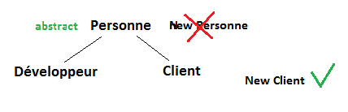

# Les classes abstraites

- Le mécanisme des classes abstraites permet de définir des comportements (méthodes) qui devront être implémentés dans les classes filles, mais sans implémenter ces comportements (c’est-à-dire sans écrire de code pour cette
méthode)
- Ainsi, on a l'assurance que les classes filles respecteront le contrat défini par la classe mère abstraite

Je rajoute juste `public abstract class Personne {` à ma classe Personne

Cela veut dire que ma classe Personne ne pourra plus être instencié. Je ne pourrai plus faire :
`new Personne` . 
En effet, je n'en ai plus besoin car je souhaite que l'utilisateur passe par `new Manager` ou `new Developpeur`

