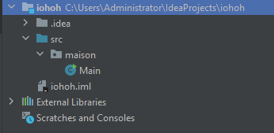

# resumeJava

- Installer l'IDE **intelliJ** qui va permettre de compiler votre code. Un très bon assistant pour votre code.

## Nouveau projet sur intelliJ

- Files > New Project > Next > cocher Create Projet from template > Donner un nom à votre projet > Finish

Comme vous avez crée un projet depuis un template vous aurez des dossiers avec votre classe Main




**Type de variable**
- int = 500; (nombre entier)
- double = 12.2; (nombre décimaux)
```java
int a = 10;
int b = 4;
double c = a / double b; // => 2.5  C'est du casting ( conversion d'une valeur dans un autre type)
```
- boolean nomVariable = true;
- char = "a"; ( un caractère )
- String = "texte";
- final int NOM_CONSTANTE = 340; ( une constante )
- float = 245.28; (nombre décimal moins précis que double. Float ne dépasse pas les 7 chiffres après la virgule )

## Lecture saisie utilisateur et afficher message de type String

```java
System.out.println("Veuillez entrer votre nom");
Scanner sc = new Scanner(System.in); // System.in : flux d'en trée de la console ( la lecture du clavier )
String nom = sc.nextLine(); // nextLine récupère le contenu. Si j'avais écris un entier dedans; Ex : 32 ENTER le scanner reçoit "32\n" . 
System.out.println(annee);
```
## Lecture saisie utilisateur et afficher message de type int

```java
System.out.println("Veuillez entrer une année");
Scanner sc = new Scanner(System.in);
int annee = sc.nextInt();
System.out.println(annee);
```

## Conversion de type (cast)
 
**String**
```java
      int a =Integer.parseInt("9"); // integer en chiffre => 9
      double b = Double.parseDouble("100"); // => 100.0
      float e = Float.parseFloat("100"); // => 100.0
      short c = Short.parseShort("100"); // => 100
      Long d = Long.parseLong("123456789"); // => 123456789  
```
**Nombre vers string**
```java
int chiffre = 123;
String s = String.valueOf(chiffre); // valueOf est une méthode qui converti différents type de valeur en string
```

## StringFormat() - Mise en forme du texte
```java
String nom = "toi";
String phrase = String.format(" Bonjour %s", nom);
System.out.println(phrase); // => Bonjour toi
```

## Conditions


### switch
```java
int weekEnd = 3;
switch (weekEnd) {
case 1:
      System.out.println("Samedi");
      break;
case 2:
      System.out.println("Dimanche");
      break;
default:
      System.out.println("Le week-end est fini");
}
// => retoune Le week-end est fini 
```

### if ternaire

```java
int heure = 20;
String result = (heure < 18) ? "Bonne journée." : "Bonne soirée.";
System.out.println(result);
// => Bonne soirée
```
## Boucles

### if
```java
int heure = 22;
if (heure < 10) { System.out.println("Bonne matinée."); } 
else if (heure < 20) { System.out.println("Bonne journee."); } 
else {System.out.println("Bonne soirée.");
} 
// => Bonne soirée
```
### for

```java
for( int i=1; i <= 10; i++) {
      System.out.println(i); // => compte de 1 à 10
}
```

### while

```java
int i=1;
while(i<=10) {
      System.out.println(i++); // compte de 1 à 10
}
```

### Do .. while ( faire tant que )
```java
int i=1;
do{
    System.out.println(i);
    i++;
}while (i <= 10);
```


